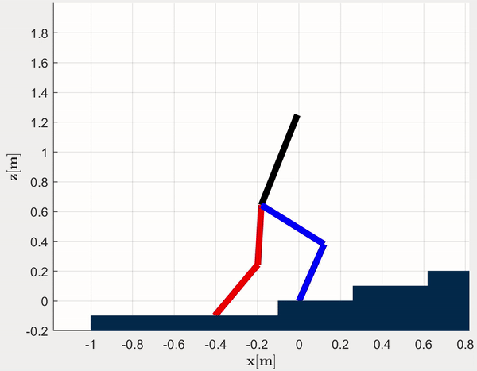

# Five-link Input-Output Nonlinear Model Predicitve for Stair Climbing
Input-Output Linearization Based Nonlinear Model Predictive Control for Planar Five Link Robot Climbing Stairs

* Preliminary work for my PhD research qualification exam (Winter 2020)
* Paper found [here](media/Gibson_Quals_Report.pdf)
